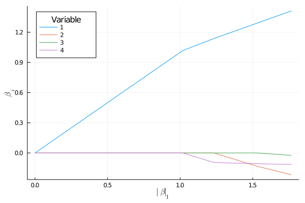

<!--- to reproduce results exactly, see readmeExamples.jl --->
# GLMNet

[](https://travis-ci.org/JuliaStats/GLMNet.jl)
[](https://coveralls.io/github/JuliaStats/GLMNet.jl)

[glmnet](http://www.jstatsoft.org/v33/i01/) is an R package by Jerome Friedman, Trevor Hastie, Rob Tibshirani that fits entire Lasso or ElasticNet regularization paths for linear, logistic, multinomial, and Cox models using cyclic coordinate descent. This Julia package wraps the Fortran code from glmnet.

## Quick start

To fit a basic regression model:

```julia
julia> using GLMNet

julia> y = collect(1:100) + randn(100)*10;

julia> X = [1:100 (1:100)+randn(100)*5 (1:100)+randn(100)*10 (1:100)+randn(100)*20];

julia> path = glmnet(X, y)
Least Squares GLMNet Solution Path (86 solutions for 4 predictors in 930 passes):
──────────────────────────────
      df   pct_dev           λ
──────────────────────────────
 [1]   0  0.0       30.0573
 [2]   1  0.152922  27.3871
 [3]   1  0.279881  24.9541
 : 
[84]   4  0.90719    0.0133172
[85]   4  0.9072     0.0121342
[86]   4  0.907209   0.0110562
──────────────────────────────
```

`path` represents the Lasso or ElasticNet fits for varying values of λ. The value of the intercept for each λ value are in `path.a0`. The coefficients for each fit are stored in compressed form in `path.betas`.

```julia
julia> path.betas
4×86 CompressedPredictorMatrix:
 0.0  0.0925032  0.176789  0.253587  0.323562  0.387321  0.445416  0.498349  0.546581  0.590527  0.63057  0.667055  0.700299  …   1.33905      1.34855     1.35822     1.36768     1.37563     1.3829      1.39005     1.39641     1.40204     1.40702     1.41195
 0.0  0.0        0.0       0.0       0.0       0.0       0.0       0.0       0.0       0.0       0.0      0.0       0.0          -0.165771    -0.17235    -0.178991   -0.185479   -0.190945   -0.195942   -0.200851   -0.20521    -0.209079   -0.212501   -0.215883
 0.0  0.0        0.0       0.0       0.0       0.0       0.0       0.0       0.0       0.0       0.0      0.0       0.0          -0.00968611  -0.0117121  -0.0135919  -0.0154413  -0.0169859  -0.0183965  -0.0197951  -0.0210362  -0.0221345  -0.0231023  -0.0240649
 0.0  0.0        0.0       0.0       0.0       0.0       0.0       0.0       0.0       0.0       0.0      0.0       0.0          -0.110093    -0.110505   -0.111078   -0.11163    -0.112102   -0.112533   -0.112951   -0.113324   -0.113656   -0.113953   -0.11424
```

This CompressedPredictorMatrix can be indexed as any other AbstractMatrix, or converted to a Matrix using `convert(Matrix, path.betas)`.

One can visualize the path by

``` julia
julia> using Plots, LinearAlgebra, LaTeXStrings

julia> betaNorm = [norm(x, 1) for x in eachslice(path.betas,dims=2)];

julia> extraOptions = (xlabel=L"\| \beta \|_1",ylabel=L"\beta_i", legend=:topleft,legendtitle="Variable", labels=[1 2 3 4]);

julia> plot(betaNorm, path.betas'; extraOptions...)
```



To predict the output for each model along the path for a given set of predictors, use `predict`:

```julia
julia> predict(path, [22 22+randn()*5 22+randn()*10 22+randn()*20])

1×86 Array{Float64,2}:
 50.3295  47.6932  45.291  43.1023  41.108  39.2909  37.6352  36.1265  34.7519  33.4995  32.3583  31.3184  30.371  29.5077  28.7211  28.0044  …  21.3966  21.3129  21.2472  21.1746  21.1191  21.0655  21.0127  20.9687  20.9284  20.8885  20.8531  20.8218  20.7942  20.7667
```

To find the best value of λ by cross-validation, use `glmnetcv`:

```julia
julia> cv = glmnetcv(X, y) 
Least Squares GLMNet Cross Validation
86 models for 4 predictors in 10 folds
Best λ 0.136 (mean loss 101.530, std 10.940)

julia> argmin(cv.meanloss)
59

julia> coef(cv) # equivalent to cv.path.betas[:, 59]
4-element Array{Float64,1}:
  1.1277676556880305
  0.0
  0.0
 -0.08747434292954445
```

### A classification Example

```julia
julia> using RDatasets

julia> iris = dataset("datasets", "iris");

julia> X = convert(Matrix, iris[:, 1:4]);

julia> y = convert(Vector, iris[:Species]);

julia> iTrain = sample(1:size(X,1), 100, replace = false);

julia> iTest = setdiff(1:size(X,1), iTrain);

julia> iris_cv = glmnetcv(X[iTrain, :], y[iTrain])
Multinomial GLMNet Cross Validation
100 models for 4 predictors in 10 folds
Best λ 0.001 (mean loss 0.130, std 0.054)

julia> yht = round.(predict(iris_cv, X[iTest, :], outtype = :prob), digits=3);

julia> DataFrame(target=y[iTest], set=yht[:,1], ver=yht[:,2], vir=yht[:,3])[5:5:50,:]
10×4 DataFrame
│ Row │ target     │ set     │ ver     │ vir     │
│     │ Cat…       │ Float64 │ Float64 │ Float64 │
├─────┼────────────┼─────────┼─────────┼─────────┤
│ 1   │ setosa     │ 0.997   │ 0.003   │ 0.0     │
│ 2   │ setosa     │ 0.995   │ 0.005   │ 0.0     │
│ 3   │ setosa     │ 0.999   │ 0.001   │ 0.0     │
│ 4   │ versicolor │ 0.0     │ 0.997   │ 0.003   │
│ 5   │ versicolor │ 0.0     │ 0.36    │ 0.64    │
│ 6   │ versicolor │ 0.0     │ 0.05    │ 0.95    │
│ 7   │ virginica  │ 0.0     │ 0.002   │ 0.998   │
│ 8   │ virginica  │ 0.0     │ 0.001   │ 0.999   │
│ 9   │ virginica  │ 0.0     │ 0.0     │ 1.0     │
│ 10  │ virginica  │ 0.0     │ 0.001   │ 0.999   │


julia> irisLabels = reshape(names(iris)[1:4],(1,4));
julia> βs =iris_cv.path.betas;
julia> λs= iris_cv.lambda;
julia> sharedOpts =(legend=false,  xlabel=L"\lambda", xscale=:log10) 
julia> p1 = plot(λs,βs[:,1,:]',ylabel=L"\beta_i";sharedOpts...);
julia> p2 = plot(λs,βs[:,2,:]',title="Across Cross Validation runs";sharedOpts...);
julia> p3 = plot(λs,βs[:,3,:]', legend=:topright,legendtitle="Variable", labels=irisLabels,xlabel=L"\lambda",xscale=:log10);
julia> plot(p1,p2,p3,layout=(1,3))
```
 

```julia
julia> plot(iris_cv.lambda, iris_cv.meanloss, xscale=:log10, legend=false, yerror=iris_cv.stdloss,xlabel=L"\lambda",ylabel="loss")
julia> vline!([lambdamin(iris_cv)])
```


## Fitting models

`glmnet` has two required parameters: the n x m predictor matrix `X` and the dependent variable `y`. It additionally accepts an optional third argument, `family`, which can be used to specify a generalized linear model. Currently, `Normal()` (least squares, default), `Binomial()` (logistic), `Poisson()` , `Multinomial()`, `CoxPH()` (Cox model) are supported. 

- For linear and Poisson models, `y` is a numerical vector of length n.
- For logistic models, `y` is either a string vector of length n or a n x 2 matrix, where the first column is the count of negative responses for each row in `X` and the second column is the count of positive responses. 
- For multinomial models, `y` is either a string vector (with at least 3 unique values) or a n x k matrix, where k is the number of unique values (classes).
- For Cox models, `y` is a n x 2 matrix, where the first column is survival time and the second column is (right) censoring status. Note that for survival data, `glmnet` has another method `glmnet(X::Matrix, time::Vector, status::Vector)` (`glmnetcv` has a corresponding method as well).


`glmnet` also accepts many optional keyword parameters as described below:

 - `weights`: A vector of length n of weights.
 - `alpha`: The tradeoff between lasso and ridge regression. This defaults to `1.0`, which specifies a lasso model.
 - `penalty_factor`: A vector of length m of penalties for each predictor/column in `X`. This defaults to all ones, which weighs each predictor equally. To unpenalize a predictor, set the corresponding entry to zero.
 - `constraints`: A 2 x m matrix specifying lower bounds (first row) and upper bounds (second row) of the predictors. By default, this is `[-Inf; Inf]` for each predictor in `X`.
 - `dfmax`: The maximum number of predictors in the largest model.
 - `pmax`: The maximum number of predictors in any model.
 - `nlambda`: The number of values of λ along the path to consider.
 - `lambda_min_ratio`: The smallest λ value to consider, as a ratio of the λ value that gives the null model (i.e., the model with only an intercept). If the number of observations (n) exceeds the number of variables (m), this defaults to `0.0001`, otherwise `0.01`.
 - `lambda`: The λ values to consider. By default, this is determined from `nlambda` and `lambda_min_ratio`.
 - `tol`: Convergence criterion, with the default value of `1e-7`.
 - `standardize`: Whether to standardize predictors so that they are in the same units, with the default value of `true`. Beta values are always presented on the original scale.
 - `intercept`: Whether to fit an intercept term. The intercept is always unpenalized. The default value is `true`.
 - `maxit`: The maximum number of iterations of the cyclic coordinate descent algorithm. If convergence is not achieved, a warning is returned. The default value is `1e6`.


## See also

 - [Lasso.jl](https://github.com/simonster/Lasso.jl), a pure Julia implementation of the glmnet coordinate descent algorithm that often achieves better performance.
 - [LARS.jl](https://github.com/simonster/LARS.jl), an implementation of least angle regression for fitting entire linear (but not
   generalized linear) Lasso and Elastic Net coordinate paths.
